# Rapport de Projet : Prédiction de la Performance Étudiante

## 1. Introduction et Objectifs

L'objectif de ce projet est de prédire la **note d'examen d'élèves**, représentée par la variable *Exam_Score*, à partir de différentes variables explicatives, tels que des facteurs socio-démographiques, habitudes d'études, ou environnement scolaire des élèves observés.

Le jeu de données utilisé, *StudentPerformanceFactors*, provient de *Kaggle* et est un jeu de données fictif qui contient 6607 observations et 19 variables, garantissant ainsi une base statistique solide pour l'entraînement de modèles de Machine Learning.

Afin de répondre à la problématique, notre démarche se comporte des étapes suivantes :

- Séparation initiale des données (Train/Test Split)
- Analyse Exploratoire et nettoyage
- Gestion des valeurs extrêmes et manquantes
- Prétraitement et transformation des variables
- Entraînement, optimisation et comparaison de plusieurs modèles de Machine Learning
- Explicabilité globale et locale du modèle retenu

---

## 2. Préparation des données et Analyse Exploratoire 

### 2.1. Train/Test Split

La première action réalisée dans notre code a été de séparer nos données en un **jeu d'entraînement** (X_train, y_train, représentant 80% du jeu de données de base) et un **jeu de test** (X_test, y_test, 20%) avant toute exploration approfondie ou imputation. Cette séparation permettra d’évaluer objectivement les performances du modèle sur des données jamais vues, afin de mesurer sa **capacité de généralisation** et d’**éviter le surapprentissage**.

En effet, séparer les données en amont est essentiel pour éviter toute fuite de données (**Data Leakage**). L'analyse exploratoire, le calcul des quantiles pour le traitement des valeurs extrêmes, ainsi que les règles d'imputation doivent être **strictement appris sur le jeu d'entraînement**. Le jeu de test doit rester totalement invisible au modèle jusqu'à l'évaluation finale pour refléter correctement sa capacité de généralisation sur de nouvelles données.

Nous avons également vérifié que la distribution de la variable cible *Exam_Score* était **équilibrée** et similaire entre les jeux de test et d'entraînement, permettant de s’assurer que le jeu de test peut faire une bonne représentation du jeu d’entraînement.

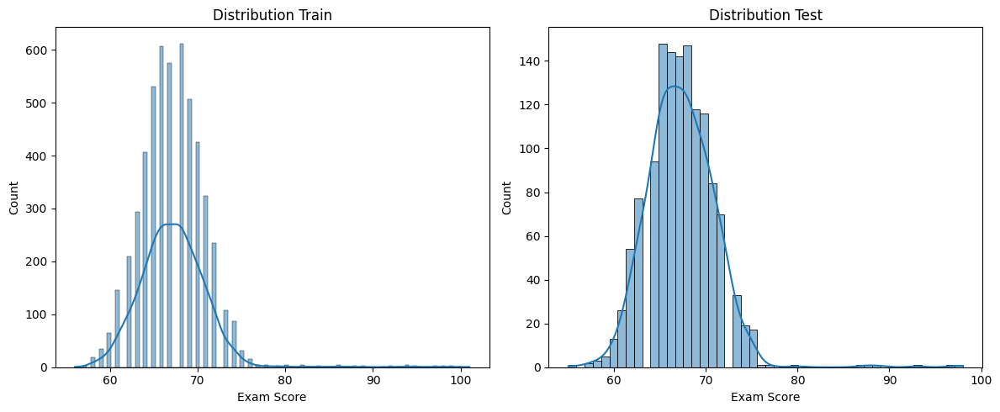

---

### 2.2. Exploration, Corrélations et Traitement des Valeurs Extrêmes

Après cela, nous avons effectué une **analyse univariée**, nous permettant d’observer la distribution et les caractéristiques de nos variables en comparant entre elles selon leur type.

Nous avons alors constaté que la majorité des variables quantitatives suivent une **distribution proche de la Loi Normale**. Néanmoins, quelques variables comme *Hours_Studied*, *Previous_Scores*, *Tutoring_Sessions* et *Physical_Activity* présentaient des **outliers**.

Ainsi, plutôt que de supprimer ces lignes et perdre de la donnée, ce qui réduirait la taille de notre dataset, d’autant plus que nous ne pourrions pas effectuer cette opération sur le jeu de test, nous avons opté pour une **winsorisation aux quantiles 1% et 99%**. Le traitement de ces valeurs est très important, car les modèles que nous allons comparer (notamment la Régression Linéaire et le SVR) sont très sensibles aux valeurs extrêmes qui peuvent introduire des biais dans les résultats.

La variable cible (*Exam_Score*) n'a cependant pas été modifiée, afin de ne pas dénaturer ce que l’on cherche à prédire, puisqu’un score d'examen extrême est une réalité terrain que le modèle doit apprendre à gérer.

Une **analyse des corrélations** a également été réalisée afin d’identifier les relations potentielles entre les variables explicatives, ainsi qu’entre ces variables et la variable cible *Exam_Score*. Cette étape est essentielle pour mieux comprendre la structure des données et orienter les choix de modélisation.

Dans un premier temps, pour les variables **numériques**, nous avons utilisé la corrélation de **Spearman**. Contrairement à la corrélation de Pearson, qui mesure uniquement les relations linéaires, la corrélation de Spearman repose sur les rangs des observations et permet ainsi de détecter des relations monotones, qu’elles soient linéaires ou non.

Dans un second temps, pour les variables **qualitatives**, nous avons utilisé la statistique de **Cramer’s V**. Cette mesure permet d’évaluer la force de l’association entre deux variables catégorielles, en s’appuyant sur le test du Chi², en obtenant une valeur normalisée comprise entre 0 (absence de relation) et 1 (relation forte), ce qui facilite l’interprétation.

Cependant, les résultats obtenus montrent que, dans l’ensemble, **les corrélations entre variables sont très faibles**, qu’il s’agisse des variables numériques ou catégorielles. 

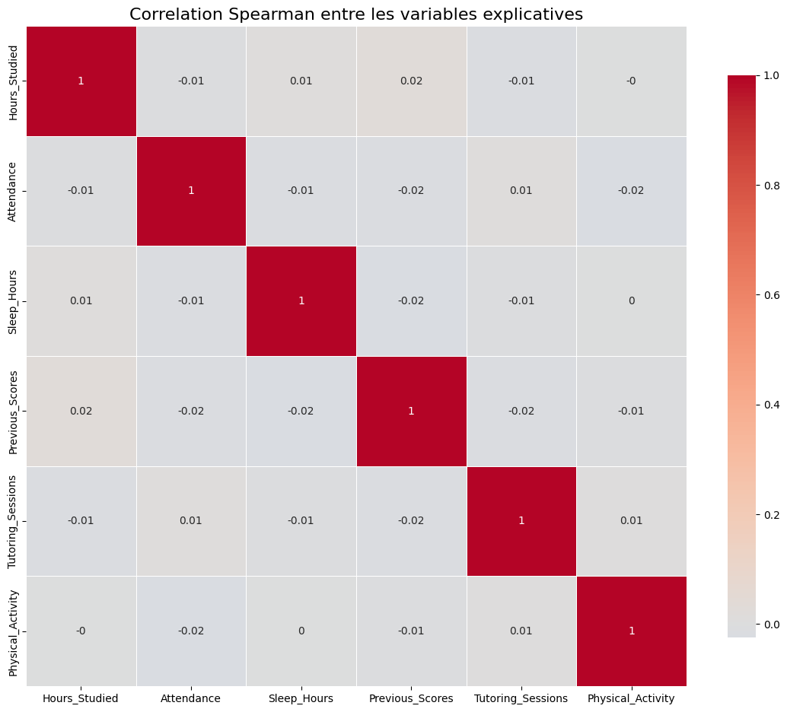

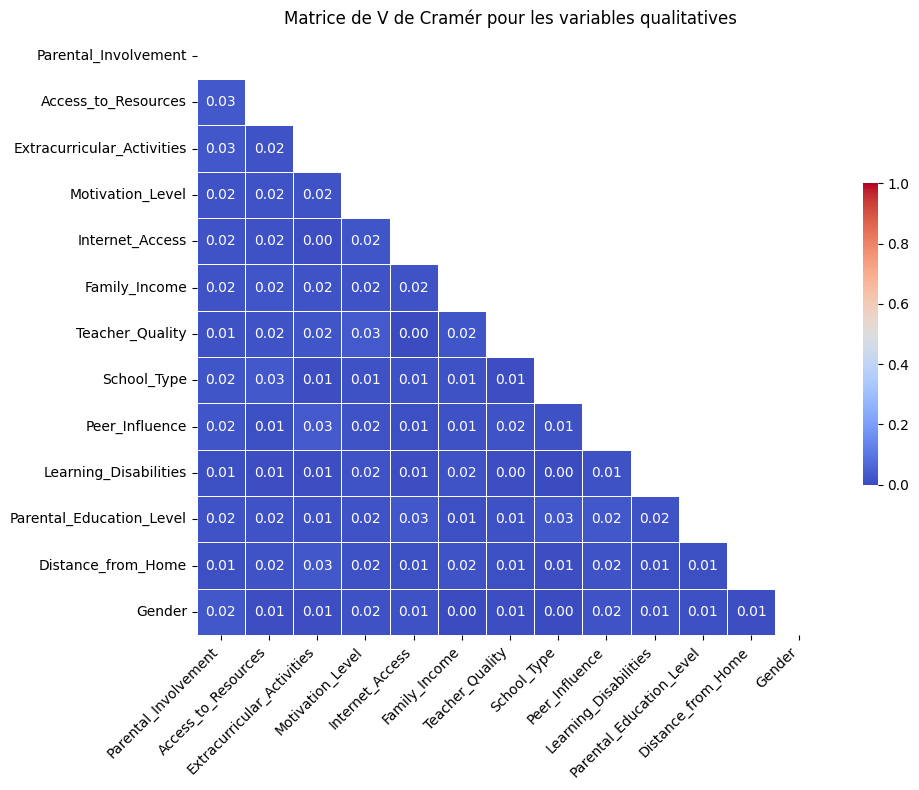

Aucune relation forte ne se dégage clairement. 

Cela s’explique probablement par le caractère fictif du jeu de données, qui ne reproduit pas fidèlement les dépendances structurelles observées dans des données réelles. Cette faible corrélation limite donc le réalisme du dataset et pourrait alors réduire la capacité des modèles à capter des relations significatives. 

Dans le cas inverse, nous aurions pu effectuer une **sélection des variables à inclure** dans notre modèle, afin d'éviter un biais de multicollinéarité. Cela pourrait notamment se faire en supprimant une à une les variables les plus corrélées à d'autres, puis en recalculant les corrélations après chaque suppression, jusqu'à ce qu'il n'existe plus de corrélations fortes selon un seuil définit, supérieures à 0,8 par exemple. 

Enfin, nous avons étudié les corrélations entre les variables explicatives et la variable cible *Exam_Score*.

Pour les variables numériques, les corrélations les plus marquées (bien que restant modérées) sont observées pour *Attendance* et *Hours_Studied*, toutes deux positivement corrélées avec la note d’examen. 

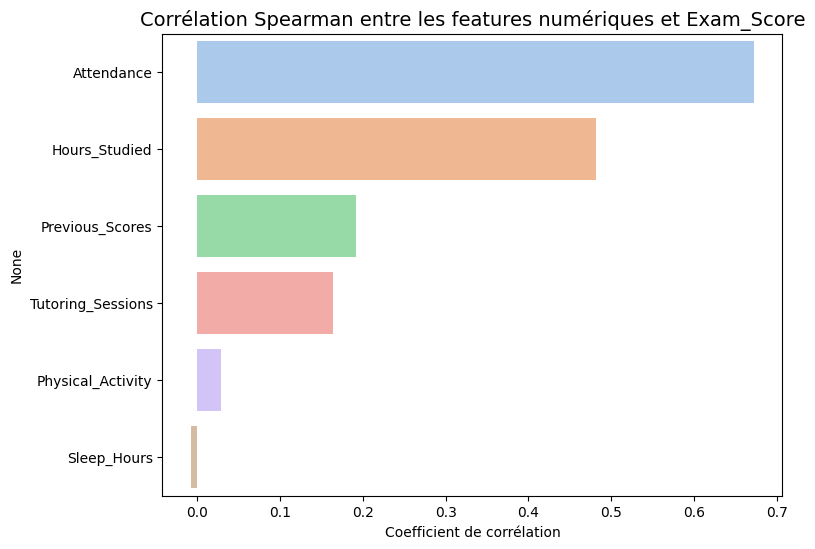

Cela suggère que **plus un élève est assidu et consacre du temps à l’étude, meilleures sont ses performances**, ce qui est cohérent avec les attentes métier.

Concernant les variables catégorielles, même si les associations restent globalement faibles, certaines variables présentent des écarts de score plus marqués entre leurs modalités. C’est notamment le cas de *Access_to_Resources*, *Parental_Involvement*, *Family_Income* et *Learning_Disabilities*. Ces variables semblent donc introduire des différences notables de performance entre groupes d’élèves, ce qui indique qu’elles **pourraient jouer un rôle explicatif important dans les modèles prédictifs**.

Globalement, bien que les corrélations observées soient globalement faibles, certaines variables clés émergent comme potentiellement influentes, justifiant leur intégration dans les étapes de modélisation ultérieures.

### 2.3. Prétraitement (Imputation, Encodage et Mise à l'échelle)

Les différents traitements effectués avant modélisation ont tous été faits à partir du jeu train, puis appliqué aux jeux train et test, pour éviter tout data leakage.

Nous avons ensuite repéré des **valeurs manquantes** dans les colonnes *Teacher_Quality*, *Parental_Education_Level* et *Distance_from_Home*.

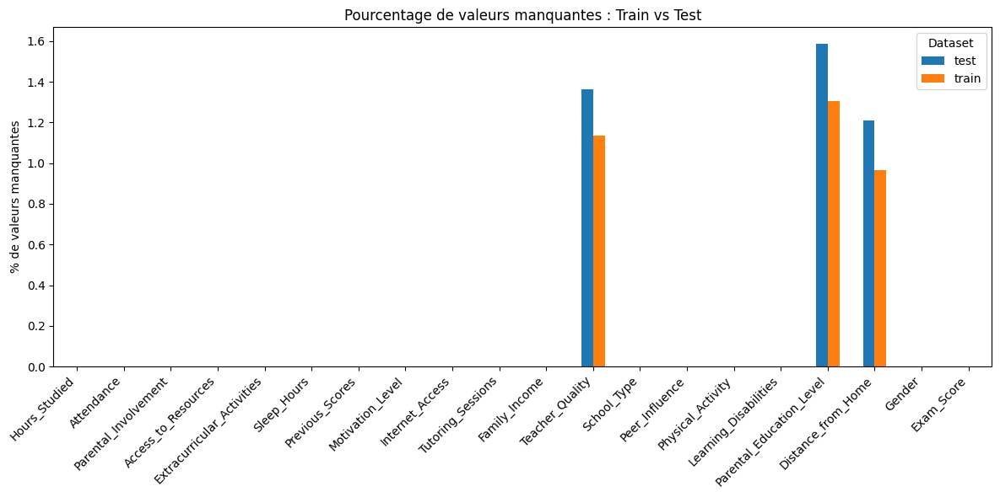

 Ces variables étant catégorielles, leur pourcentage de valeurs manquantes étant très faibles, et l’analyse descriptive ne nous rapportant pas beaucoup d’informations nous permettant de déduire des façons d’imputer ces valeurs manquantes, nous avons décidé de les remplacer par la **valeur la plus fréquente** pour chacune de ces variables.

Concernant le **feature engineering**, nous avons créé une nouvelle variable appelée *Parent_Context*, qui combine le niveau d’éducation des parents et le revenu familial. 

L’objectif de cette variable est de capter un effet d’interaction entre ces deux variables, car leur combinaison peut être plus explicative de l’environnement socio-économique de l’élève que chacune prise séparément. Cela permet potentiellement d’améliorer la capacité prédictive du modèle en introduisant une information plus riche. 

Nous avons ensuite observé la distribution de cette variable, et constaté que **2 modalités étaient très peu représentées (<6%)**. 

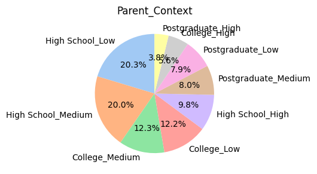

Afin d'améliorer la pertinence de la variable pour notre modèle, nous avons décidé de **regrouper** ces 2 catégories en une seule catégorie "Autres".

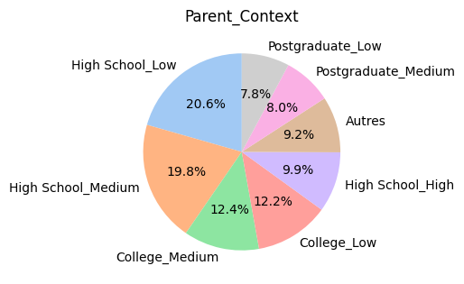

Puis, avant la modélisation, certains traitements ont dû être effectués. Notamment l’**encodage des variables catégorielles**.

Pour les variables catégorielles à **faible cardinalité** (ex : Genre, Activités extrascolaires), nous avons utilisé le ***OneHotEncoder***. 

Pour les variables à plus **forte cardinalité**, nous avons utilisé un ***TargetEncoder***. 

Cette méthode consiste à remplacer chaque catégorie par la moyenne de la variable cible associée à cette catégorie. Cela permet de réduire fortement la dimensionnalité tout en conservant une information statistique pertinente, contrairement au OneHotEncoder qui aurait généré un grand nombre de variables peu informatives et potentiellement du bruit.

Enfin, nous avons **standardisé** nos données, pour les variables numériques (sans prendre en compte les variables ayant été encodées qui sont donc déjà standardisées). 

Pour ce faire, nous avons appliqué la méthode du ***StandardScaler***. Cela est notamment utile pour l'algorithme du SVR qui base son optimisation sur le calcul de distances géométriques dans l'espace des features. 

Standardiser les données permet de mettre à la même échelle des variables avec des unités de mesures différentes.

Ainsi, sans standardisation, une variable avec une grande échelle (ex: *Previous_Scores*) écraserait complètement l'impact des variables à petite échelle (ex: *Tutoring_Sessions*). De plus, cela garantit une convergence plus rapide pour le modèle linéaire.

---

## 3. Modélisation et Comparaison des Modèles

Par la suite, pour répondre à notre objectif de prédiction, nous avons implémenté et comparé différentes familles d'algorithmes. Cette diversité permet de confronter différentes hypothèses mathématiques sur la structure des données.

### 1. Régression Linéaire Multiple :

Ce modèle pose l'hypothèse d'une **relation strictement linéaire** entre nos facteurs et la note d'examen. Cela nous sert alors de modèle de référence, ce qui sous-entend que si les modèles complexes ne font pas mieux, c'est que la relation sous-jacente est simple.

### 2. Random Forest Regressor :

Ensuite, nous avons testé un modèle de ***Random Forest***, modèle ensembliste basé sur la méthode du **Bagging**. Il permet notamment de modéliser des interactions non linéaires complexes sans nécessiter de standardisation des données, même si celle-ci n’impacte pas ses performances. Il est également très résilient face au surapprentissage (overfitting) grâce à la construction de multiples arbres de décision indépendants.

### 3. AdaBoost Regressor :

Nous avons également implémenté un modèle ***AdaBoost***, qui repose sur une approche de **Boosting**. Contrairement au bagging , le boosting construit les modèles de manière séquentielle, chaque nouveau modèle cherchant à corriger les erreurs du précédent. AdaBoost accorde ainsi plus de poids aux observations mal prédites au fil des itérations. Ce type de modèle est particulièrement efficace pour capturer des relations complexes, mais il peut être sensible au bruit et aux valeurs aberrantes, ce qui justifie d’autant plus le travail préalable de winsorisation.

### 4. XGBoost Regressor :

Puis, nous avons testé le modèle ***XGBoost***, une implémentation optimisée du **gradient boosting**. Il repose sur une descente de gradient appliquée à des arbres de décision, tout en intégrant des mécanismes de régularisation (L1 et L2) afin de limiter le surapprentissage. Ce modèle est réputé pour gérer efficacement les interactions complexes entre variables et optimiser automatiquement la structure des arbres.

### 5. Support Vector Regressor (SVR) :

Enfin, le ***Support Vector Regressor**, faisant partie de la famille des **SVM**, permet de projeter les données dans un espace de plus grande dimension où la relation devient séparable. Il vise à minimiser l'erreur tout en tolérant un certain écart grâce à sa marge. 

---

### Optimisation et Résultats :

Afin d’obtenir les meilleurs modèles possibles, pour chacun des modèles testés les hyperparamètres ont été optimisés via **validation croisée**, en commençant par une recherche large à l’aide d’un ***RandomizedSearchCV***, suivie d’une recherche plus précise auprès des meilleurs hyperparamètres ressortant, à partir d’un ***GridSearchCV***, en cherchant le modèle avec le moins d’erreurs, minimisant le RMSE. Cela permet d'ajuster le compromis **biais-variance** (par exemple, gérer la profondeur des arbres pour le Random Forest ou le paramètre de régularisation pour le SVR).

A l’issue de la comparaison des résultats, c’est le modèle **SVR** qui s’est avéré être le plus performant, **minimisant les erreurs (MSE, MAE, et RMSE)**, tout en **maximisant la qualité des prévisions du modèle (R2)**.

Le meilleur modèle obtenu est donc un SVR avec les hyperparamètres suivants :
***{'C': 700, 'epsilon': 0.8, 'kernel': 'linear'}***

- *C (paramètre de régularisation = 700)* : Tout d'abord, ce paramètre **contrôle le compromis biais-variance**. Une valeur élevée de C signifie que le modèle pénalise fortement les erreurs, cherchant donc à s’ajuster au plus près des données d’entraînement. Cela réduit le biais mais augmente le risque de surapprentissage. Ici, la valeur élevée indique que les données présentent une **structure suffisamment stable** pour supporter un ajustement précis.

- *epsilon = 0.8* : Ce paramètre définit la largeur de la **zone de tolérance autour de la prédiction dans laquelle les erreurs ne sont pas pénalisées**. Une valeur relativement élevée signifie que le modèle tolère de petites erreurs sans chercher à les corriger, ce qui améliore la robustesse face au bruit et évite un ajustement excessif.

- *kernel = linear* : Le choix d’un noyau linéaire indique que la **relation entre les variables explicatives et la cible** est globalement **linéaire**. Cela confirme les observations faites précédemment : malgré la complexité potentielle des données, une structure linéaire semble suffisante pour expliquer la majorité de la variance.

Cependant, nous pouvons tout de même noter qu’il ne dépasse le modèle simple de régression linéaire que de peu.

 **Dans notre cas, nous choisirons donc de suivre les chiffres et d’interpréter le modèle SVR dans la suite de notre projet.** Néanmoins, dans un cas concret de recherche ou d'entreprise, l’application d’un modèle linéaire pourrait être plus pratique car plus simple à mettre en place, à faire comprendre et à interpréter qu’un modèle complexe comme un SVR qui n’apporte finalement pas beaucoup d’informations supplémentaires.

---

## 4. Explicabilité et Interprétabilité du Modèle (SVR)

Comme évoqué précédemment, un modèle complexe comme un SVR peut être plus compliqué à interpréter ; l'adoption de ce type de modèle est souvent freinée par son aspect "boîte noire".

Néanmoins, étant donné que le modèle SVR ici retenu est linéaire, les relations entre les variables explicatives et la variable cible sont elles-mêmes linéaires et additives. 

Dans ce contexte, l’interprétation des **coefficients** constitue l’outil principal d’analyse globale, car elle permet de mesurer directement l’influence marginale de chaque variable. 

Puis, **l’importance des variables par permutation** peut être utilisée en complément pour confirmer les tendances observées, bien qu’elle soit souvent redondante avec l’analyse des coefficients dans un modèle linéaire.

Enfin, des méthodes d’explicabilité **locale** comme ***LIME*** et ***SHAP*** restent également pertinentes, car elles permettent de comprendre de manière plus fine les prédictions individuelles. 

En revanche, des méthodes telles que les PDP, ICE ou ALE, généralement utilisées pour analyser des relations non linéaires ou des interactions complexes, apportent peu d’informations supplémentaires dans notre cas.

Nous avons donc appliqué des méthodes d'explicabilité globales et locales pertinentes à notre modèle afin de mieux comprendre les résultats obtenus.

### 4.1. Interprétabilité Globale

1. Observation de la **distribution des résidus** : 

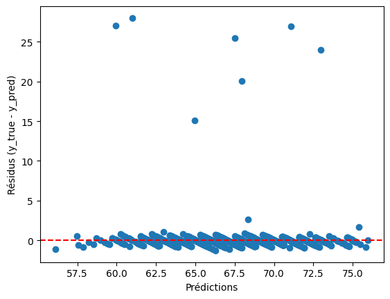

Pour commencer, l’observation de la distribution des résidus nous montre que malgré la présence de quelques valeurs dispersées, la majorité des résidus sont répartis de manière homogène autour de 0. Cela indique que le modèle **ne présente pas de biais systématique** (ni sous-estimation ni surestimation globale).

2. Analyse des **coefficients** :

Ensuite, l’analyse des coefficients permet d’évaluer **l’influence marginale de chaque variable sur la note d’examen** (*Exam_Score*), toutes choses égales par ailleurs. **Un coefficient positif indique alors qu’une augmentation (ou la présence) de la variable est associée à une hausse de la note, tandis qu’un coefficient négatif indique l’effet inverse.**

Dans le cas des variables catégorielles encodées en One Hot Encoding, les coefficients s’interprètent relativement à une catégorie de référence, qui a été supprimée afin d’éviter la colinéarité parfaite.

Globalement, les résultats mettent en évidence trois grands axes explicatifs de la performance étudiante :

- 1) Les **efforts académiques** et **l’engagement personnel** comme facteurs dominants

Les variables les plus influentes sont directement liées au comportement scolaire de l’élève. L’assiduité (*Attendance*, coefficient ≈ +2.30) apparaît comme le facteur le plus déterminant, suivie du temps d’étude (*Hours_Studied*, ≈ +1.83). Cela confirme que **la présence en cours et le travail personnel sont les leviers principaux de la réussite académique**.

Les performances passées (*Previous_Scores*, ≈ +0.70) jouent également un rôle important, suivant la logique que **les bons élèves ont tendance à le rester**.

Enfin, les sessions de tutorat (*Tutoring_Sessions*, ≈ +0.62) ont un impact positif, suggérant que **l’accompagnement pédagogique contribue à améliorer les résultats**.

- 2) **L’environnement éducatif et socio-économique** comme facteurs structurants

Un second groupe de variables met en évidence l’importance du contexte dans lequel évolue l’élève. Une influence positive de l'entourage (*Peer_Influence_Positive*, ≈ +1.04), une proximité avec l’établissement (*Distance_from_Home_Near*, ≈ +1.00) ainsi qu’un accès à Internet (*Internet_Access_Yes*, ≈ +0.99) sont fortement associés à de meilleures performances.

De plus, certaines variables comme la participation à des activités extrascolaires (*Extracurricular_Activities_Yes*, ≈ +0.50), un niveau d’éducation parental élevé (*Postgraduate*, ≈ +0.40) ou encore une activité physique régulière (*Physical_Activity*, ≈ +0.24) contribuent également positivement à la réussite.

Ces résultats traduisent l’importance d’un **environnement globalement favorable**, tant sur le plan **scolaire** que **personnel**.

- 3) Les **effets négatifs** associés aux **contextes défavorables**

À l’inverse, les coefficients négatifs reflètent des **situations moins propices à la réussite**, toujours interprétées relativement à la catégorie de référence. Un faible accès aux ressources (*Access_to_Resources_Low*, ≈ -1.98), par rapport à un fort accès, et un faible engagement parental (*Parental_Involvement_Low*, ≈ -1.97), en comparaison avec un fort engagement parental, figurent parmi les facteurs les plus pénalisants.

Des variables telles qu’un revenu faible (*Family_Income_Low*, ≈ -1.02), une mauvaise qualité d’enseignement (*Teacher_Quality_Low*, ≈ -1.03), ou encore un faible niveau de motivation (*Motivation_Level_Low*, ≈ -1.02) contribuent également à une baisse significative des performances.

Puis, la présence de troubles d’apprentissage (*Learning_Disabilities_Yes*, ≈ -0.93) est logiquement associée à une diminution de la note par rapport aux élèves n'en ayant pas, tandis que certaines modalités intermédiaires (ex : Medium) présentent également des effets négatifs modérés, traduisant un gradient de performance entre les différentes catégories.

- 4) Variables **faiblement explicatives**

Enfin, certaines variables présentent des coefficients très proches de zéro, comme le genre, le type d’établissement ou encore le nombre d’heures de sommeil. Nous retrouvons parmi celles-ci également notre variable créée, *Parent_Context*. Cela suggère qu’elles ont un **impact marginal faible** sur la performance dans ce jeu de données, ou que leur **effet est déjà capturé indirectement par d’autres variables**.

Dans l’ensemble, le modèle met en évidence que la réussite académique repose principalement sur les facteurs suivants : **l’investissement personnel de l’élève, la qualité de son environnement éducatif et le contexte socio-économique**. Les variables comportementales apparaissent comme les plus déterminantes, ce qui souligne que, même si le contexte joue un rôle important, les efforts individuels restent le levier principal de performance.

Nous pouvons également noter que ces résultats sont similaires aux coefficients déterminés par le modèle simple de régression linéaire.

3. **Permutation Feature Importance** :

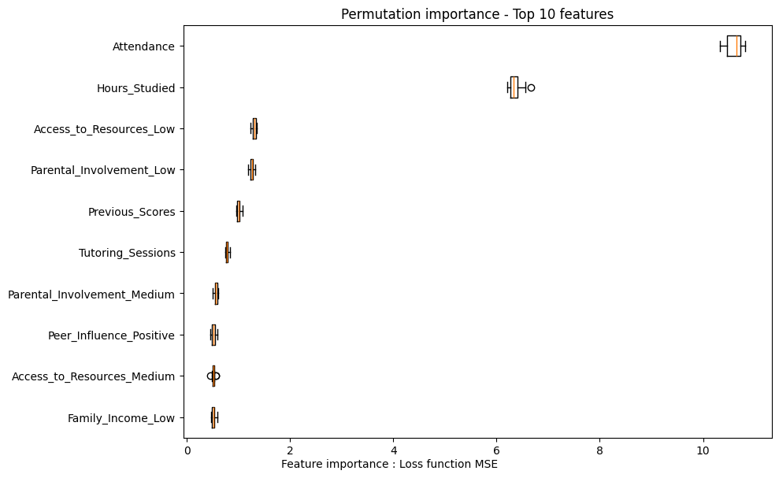

Après cela, l’analyse de l’importance des variables par permutation **confirme globalement les résultats obtenus à partir des coefficients**. L’assiduité (*Attendance*) et le temps d’étude (*Hours_Studied*) apparaissent comme les variables les plus déterminantes, avec un impact très largement supérieur aux autres.

Elles sont suivies par des variables liées au contexte éducatif et familial, telles que *Access_to_Resources_Low*, *Parental_Involvement_Low* ou encore *Previous_Scores*, qui contribuent également de manière significative à la performance du modèle.

Enfin, certaines variables comme le genre, le type d’établissement ou encore *Parent_Context* ont une importance quasi nulle, confirmant leur faible contribution prédictive.

Ainsi, la permutation feature importance vient renforcer la conclusion selon laquelle **les principaux moteurs de la performance académique sont l’engagement personnel de l’élève et son environnement éducatif**.

### 4.2. Interprétabilité Locale : LIME & SHAP

Pour comprendre finement la prise de décision sur un cas spécifique, nous avons extrait les prédictions de différents individu ; l'individu n°505 via LIME (Local Interpretable Model-agnostic Explanations) et l’individu n°86 via SHAP (SHapley Additive exPlanations).

1. **LIME** :

Premièrement, LIME permet de générer un modèle linéaire de substitution, interprétable autour du voisinage immédiat de notre individu. Pour l'étudiant 505, la prédiction est principalement influencée par un **effet fortement positif de sa bonne assiduité** (*Attendance* > 0.88 génère +4.08 points).

Cependant, LIME nous montre que pour cet étudiant précis, le **nombre d'heures étudiées** (*Hours_Studied* <= -0.67) **tire sa note vers le bas** (-3.28) et un **faible accès aux ressources la tire vers le haut** (+2.14).

Ces résultats locaux peuvent alors sembler **contre-intuitifs** par rapport à la tendance globale (où étudier plus aide généralement à avoir de meilleures notes). En fait, le modèle SVR a identifié un **comportement complexe propre au profil de cet étudiant**. Le modèle ajuste donc localement son score à la baisse.

Ainsi, LIME met en évidence que, bien que certaines tendances globales soient respectées (notamment l’importance de l’assiduité), des comportements locaux atypiques peuvent émerger, soulignant la complexité du modèle.

2. **SHAP values** :

Les Waterfall et beeswarm plots fait à partir de SHAP **confirme les constats globaux** fait précédemment. En partant de la valeur moyenne de tous les élèves, le graphique ajoute et soustrait les valeurs de Shapley exactes de chaque caractéristique de l'étudiant 86 pour aboutir à sa prédiction finale exacte. Cela permet une décomposition parfaite de la prédiction sans biais d'approximation.

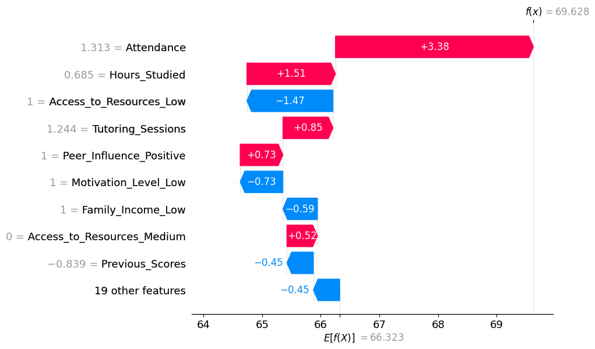

Tout d'abord, le graphique ***waterfall*** permet de décomposer précisément la prédiction d’un individu en partant de la valeur moyenne du modèle jusqu’à la prédiction finale de 69.63.

On observe que **certaines variables contribuent fortement à l’augmentation de la prédiction**, notamment :
- l’assiduité,
- le temps d’étude,
- les sessions de tutorat,
- l’influence positive des pairs.

À l’inverse, **des variables défavorables viennent réduire la prédiction**, comme :
- un faible accès aux ressources,
- un faible niveau de motivation,
- un revenu familial faible.

Cette décomposition met donc en évidence un équilibre entre facteurs positifs et négatifs, expliquant la valeur finale prédite.

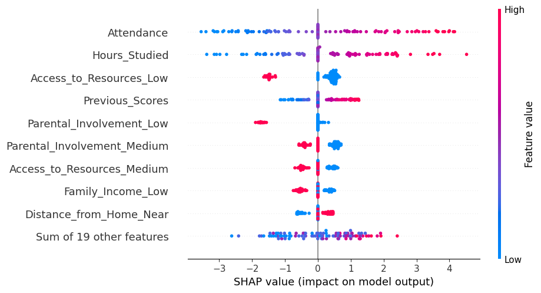

Enfin, le graphique ***beeswarm*** fournit une vision globale de l’impact des variables sur l’ensemble des individus, et confirme que les **variables les plus influentes** sont :
- l’assiduité (*Attendance*),
- le temps d’étude (*Hours_Studied*),
- les performances passées (*Previous_Scores*).

Les couleurs montrent que des **valeurs élevées de ces variables (en rouge) sont associées à des contributions positives au score, tandis que des valeurs faibles (en bleu) ont un impact négatif**.

À l’inverse, des variables comme *Access_to_Resources_Low* ou *Parental_Involvement_Low* ont un **impact négatif** marqué lorsqu’elles sont présentes.
Pour finir, certaines variables ont un **impact faible et peu structurant**, ce qui est cohérent avec les résultats observés via les coefficients et la permutation feature importance.

---

## 5. Conclusion

Pour conclure, ce projet avait pour objectif de **prédire la performance académique d’étudiants à partir de variables socio-démographiques et comportementales**, en mobilisant un pipeline complet de data science.

Les différentes étapes de la préparation des données à l’explicabilité du modèle ont permis de mettre en évidence plusieurs points clés. 

Tout d’abord, le **prétraitement des données** (gestion des valeurs manquantes, traitement des outliers, encodage et standardisation) joue un rôle déterminant dans la performance des modèles. 

Ensuite, la **comparaison de plusieurs algorithmes** a montré que, malgré la complexité des méthodes ensemblistes ou du boosting, **un modèle relativement simple comme le SVR linéaire (ou même la régression linéaire) peut être tout aussi performant** ou même davantage performant qu’un modèle plus complexe.

Dans notre cas, cela s’explique notamment par la structure des données, qui présentent peu de corrélations fortes et semblent majoritairement linéaires.

Puis, l’analyse d’interprétabilité globale a confirmé **l’importance de variables clés telles que l’assiduité, les notes passées et le temps d’étude**, ce qui est cohérent selon la logique de socialisation. Les méthodes locales ont également permis d’aller plus loin, en **expliquant des cas individuels**, mettant en évidence des comportements spécifiques que les analyses globales ne permettent pas de détecter.

Enfin, ce projet illustre un point essentiel : **le modèle le plus performant n’est pas toujours le plus complexe**. Dans un cadre opérationnel, un modèle plus simple, interprétable et robuste peut être préférable, notamment pour faciliter la prise de décision et l’appropriation par les parties prenantes.

En perspective, **l’amélioration du réalisme du jeu de données**, ainsi que **l’intégration de variables supplémentaires** (*psychologiques, pédagogiques ou encore contextuelles*), pourraient permettre d’obtenir des modèles plus performants et plus proches des situations réelles.